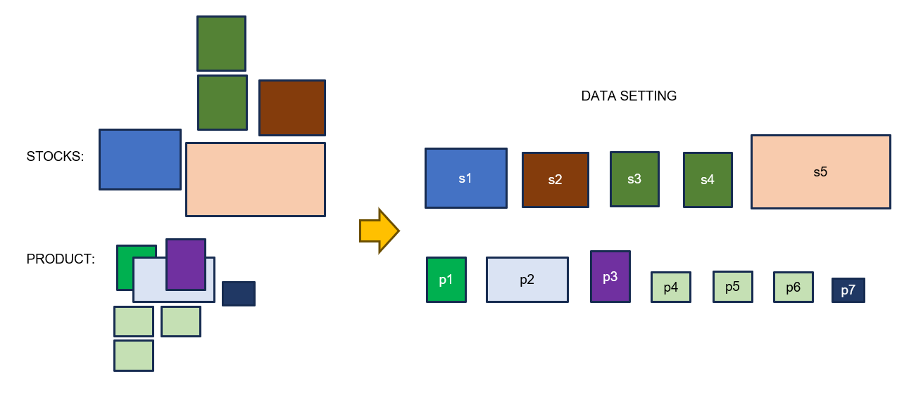

# 🧩 2D Cutting Stock Problem Solver (PPO, Q-Learning & Heuristic Approaches)

This repository presents a comprehensive solution to the **2D Cutting Stock Problem (2D-CSP)** using both **Reinforcement Learning** (PPO, Q-Learning) and **Heuristic algorithms**. The project focuses on optimizing material usage in industrial settings (e.g., glass, wood, metal cutting), reducing waste, and minimizing the number of stock sheets used.

---

## 📌 Slide

```bash
📦
├── 📁 1_slide
│   └── 📄 AI17C_Group3_Project.pptx
```

## 📌 Report 

```bash
📦
├── 📁 Report_Cutting_Stock_2D
|   └──REPORT_GROUP3_3_23_2025_FPT.pdf
```

## 📌 Problem Description

In manufacturing industries, large material sheets must be cut into smaller rectangles to meet demand. The challenge lies in:

- Reducing **total trim loss** (wasted material).
- Minimizing **number of stock sheets used**.
- Ensuring **feasible, non-overlapping placements**.

The project models this as a **2D-CSP** with strict constraints:
- Demand satisfaction.
- Material utilization within boundaries.
- No overlapping placements.
- Cut pieces must start from sheet edges.
- Fixed orientations (no rotation).

---

## 📌 Constraints

To ensure feasibility and optimize production efficiency in the 2D Cutting Stock Problem, the following constraints are applied:

### 1. Demand Fulfillment Constraint  
**Objective**: Ensure that the number of cut pieces meets or exceeds demand for each item.  

**Expression:**  
    ∑ⱼ (aᵢⱼ × xⱼ) ≥ dᵢ  ∀i

- aᵢⱼ: number of item i in pattern j  
- xⱼ: number of times pattern j is used  
- dᵢ: demand of item i  

---

### 2. Material Utilization Constraint  
**Objective**: Ensure the total area of all cut pieces in a pattern does not exceed the raw stock area.  

**Expression:**  
    ∑ᵢ (wᵢ × hᵢ × aᵢⱼ) ≤ W × H  ∀j

- wᵢ, hᵢ: width and height of item i  
- W, H: width and height of the stock material  

---

### 3. Non-Overlapping Constraint  
**Objective**: No two pieces in the same pattern overlap. This is handled using geometric or combinatorial "no-overlap" conditions.  

---

### 4. Binary and Non-Negativity Constraints  
**Objective**: Ensure logical and implementable decisions.  

- Binary decision variables: xᵢⱼ ∈ {0, 1}  
- Number of uses of each pattern must be non-negative: xⱼ ≥ 0  

---

### 5. Seamless and Starting from the Edge Constraint  

To optimize material usage and simplify the cutting process, pieces must be:

- **Seamless**: placed without unnecessary gaps  
- **Starting from the edge**: the first cuts must touch the edge of the material sheet  

Assuming the sheet has size W × H, and each piece i has top-left coordinates (xᵢ, yᵢ) and dimensions (wᵢ, hᵢ), the placement constraint is:

    xᵢ = 0      or    xᵢ = xⱼ + wⱼ  
    yᵢ = 0      or    yᵢ = yⱼ + hⱼ  

This ensures that each piece is either aligned with the sheet edge or with another piece.

To avoid large unusable gaps between pieces, we also enforce:

    xᵢ₊₁ = xᵢ + wᵢ      or     yᵢ₊₁ = yᵢ + hᵢ


### 6. Orientation Constraint  
**Objective**: Treat pieces with the same dimensions but different orientations (e.g., 4×2 vs. 2×4) as distinct types. Orientation must follow predefined rules. Stocks and products are indexed starting from 1 (0 in code).

### 7. Orientation Constraint  
**Objective**: Stocks and products are numbered sequentially starting from 1 (index is 0 in the code) regardless of their similar size.


---


## 🧠 Approaches

### 1. 🔧 Heuristic Algorithms

We implemented and compared three classic heuristics:

| Algorithm       | Description                                                                 | Pros                        | Cons                         |
|----------------|-----------------------------------------------------------------------------|-----------------------------|------------------------------|
| **First-Fit**   | Places each item in the first stock where it fits.                         | Fast, easy to implement     | May leave large unused gaps |
| **Best-Fit**    | Places each item where it leaves the least remaining space.                | Better utilization          | Slower than First-Fit       |
| **Combination** | Combines First-Fit and Best-Fit + stock merging optimization.              | Balanced performance        | Slightly more complex       |

> ✅ See implementation in: `first_fit_policy`, `best_fit_policy`, and `combination_policy`

---

### 2. 🤖 Reinforcement Learning - PPO

We implemented a **Proximal Policy Optimization (PPO)** agent using a custom Gym environment (`CuttingGlassEnv`) to learn cutting strategies over time.

#### ⚙ PPO Architecture
- **Actor-Critic model**
- **CNN** for spatial feature extraction from stocks & valid mask
- **MLP** for encoding product information
- **Actor network** predicts:
  - Product to cut
  - Cutting position (x, y)
  - Orientation (fixed in this project)
- **Critic network** estimates state-value \( V(s) \)

#### 📈 Reward Function

The custom reward encourages:
- High **filled ratio**.
- Low **trim loss**.
- Bonus for **unused stock sheets**.

#### ⚠ PPO Limitations Observed
- Slower convergence.
- May require more fine-tuning.
- Sometimes underperforms heuristics on small datasets.

---

### 3. 🧠 Reinforcement Learning - Q-Learning

In addition to PPO, we implemented a **Q-Learning** agent to compare value-based learning approaches in discrete action-state spaces.

#### 📌 Key Concepts

- **Q-table**: Stores expected rewards \( Q(s, a) \) for each state-action pair.
- **Epsilon-greedy** strategy for balancing exploration and exploitation.
- **Tabular updates** using Bellman Equation:

$$
Q(s, a) \leftarrow Q(s, a) + \alpha \left[ r + \gamma \max_{a'} Q(s', a') - Q(s, a) \right]
$$


#### 🔢 State Encoding

Simplified representation using:
- `empty_space`: Total available space.
- `remaining_products`: Remaining product quantity.

> Combined as: `state = (empty_space * 1000 + remaining_products) % state_size`

#### 🎮 Action Mapping

Each action is an index mapped to:
- Product index
- Cutting position (x, y)

Invalid actions are skipped or retried.

#### 🏆 Reward Strategy

| Reward Component         | Description                                              |
|--------------------------|----------------------------------------------------------|
| **Filled Ratio**         | Positive reward for high area usage                      |
| **Trim Loss**            | Penalized for unused space                               |
| **Unused Stock Bonus**   | Encourages fewer sheets used                             |
| **Final Completion Bonus** | Extra reward when task completed                        |

#### 📉 Limitations

- May lose spatial info in simple encoding.
- Less flexible in complex environments.
- Requires good hyperparameter tuning.

---

## 📁 Repository Structure

```

📦
├── 📄 data_check.py
├── 📄 gen_data.py
├── 📄 LICENSE
├── 📄 README.md
├── 📄 requirements.txt
├── 📄 show_report_5_method.py
├── 📄 visualization.py
│
├── 📁 1_slide
│   └── 📄 AI17C_Group3_Project.pptx
│
├── 📁 data
│   ├── 📄 data_custom.csv
│   ├── 📄 policy_comparison_results_5_method.csv
│   └── 📊 stock_product_analysis.png
│
├── 📁 documentation
|   ├── 📄 BartoSutton.pdf
|   └── 📄 Michael T. Goodrich, Roberto Tamassia, Michael H. Goldwasser-Data Structures and Algorithms in Python-Wiley (2013).pdf
│
├── 📁 heuristic_app
│   ├── 📄 README.md
│   ├── 📄 report_heuristic.py
│   ├── 📄 show_report_heuristic.py
│   │
│   ├── 📁 data
│   │   ├── 📄 data_custom.csv
│   │   ├── 📄 policy_comparison_results.csv
│   │   └── 📊 stock_product_analysis.png
│   │
│   ├── 📁 env
│   │   └── 🧠 cutting_stock.py
│   │
│   ├── 📁 policy
│   │   ├── ⚙️ BestFit_Policy.py
│   │   ├── ⚙️ Combination_Policy.py
│   │   └── ⚙️ FirstFit_Policy.py
│   │
│   └── 📁 results
│       ├── 📊 comparison.png
│       └── 📊 comparison_5_method.png
│
├── 📁 ppo_app
│   ├── 🧠 cutting_glass_env.py
│   ├── 📄 main.py
│   ├── 🤖 ppo_agent.py
│   ├── 🧠 ppo_policy.py
│   ├── 📄 README.md
│   ├── 🧪 test.py
│   └── 📊 visualize.py
│
│   ├── 📁 Loss_Plots
│   │   ├── 📈 loss_plot_ep21000.png
│   │   └── 📄 README.md
│   │
│   └── 📁 Model
│       ├── 💾 ppo_policy_ep21000.pth
│       └── 📄 README.md
│
├── 📁 qlearning_app
│   ├── 📊 evaluation_all_batches.png
│   ├── 📄 metrics.csv
│   ├── 📊 metrics.png
│   ├── 📄 README.md
│
│   ├── 📁 agents
│   │   ├── 🤖 dqn_agent.py
│   │   ├── 🧠 q_learning_agent.py
│   │   └── 📄 __init__.py
│
│   ├── 📁 data
│   │   ├── 📄 data_custom.csv
│   │   └── 📄 static_data.py
│
│   ├── 📁 env
│   │   ├── 🧠 CuttingStockEnv.py
│   │   ├── 🧠 CuttingStockEnvOptimized.py
│   │   └── 📄 __init__.py
│
│   ├── 📁 evaluation
│   │   ├── 📊 evaluate.py
│   │   └── 📄 __init__.py
│
│   └── 📁 training
│       └── 🏋️ train_q_learning.py
│
├── 📁 Report_Cutting_Stock_2D
|   └──REPORT_GROUP3_3_23_2025_FPT.pdf
│
└── 📁 results
    └── 📊 comparison_5_method.png

```

---

## 📊 Evaluation Metrics

| Metric               | Description                                               |
|----------------------|-----------------------------------------------------------|
| **Runtime (s)**       | Time taken for each approach                             |
| **Total Trim Loss**   | Sum of unused areas in used sheets                       |
| **Used Stocks**       | Number of sheets used to fulfill demand                  |
| **Remaining Stocks**  | Unused stock count                                       |
| **Avg Used Stock Area** | Avg area covered in each used sheet                    |

---

## 📈 Comparison Summary


| Method       | Trim Loss ↓             | Used Stocks ↓         | Speed ↑     | Learning Capability ↑ |
|--------------|--------------------------|------------------------|-------------|------------------------|
| **First-Fit**   | ⚠️ Medium               | ✅ Low                 | ✅✅✅       | ❌                    |
| **Best-Fit**    | ✅ Lowest               | ⚠️ Slightly High       | ✅           | ❌                    |
| **Combination** | ✅ Balanced             | ✅ Balanced            | ✅✅         | ❌                    |
| **PPO**         | ❌ High                 | ❌ High                | ⚠️ Slow      | ✅✅✅                 |
| **Q-Learning**  | ⚠️ Unstable (varies)    | ⚠️ Inconsistent        | ✅✅✅       | ✅✅                   |

---

## 🚀 Getting Started

### Install Dependencies
```bash
pip install -r requirements.txt
```

### Use heuristic
```bash
python heuristic_app/report_heuristic.py
python heuristic_app/show_report_heuristic.py
```

### Train PPO Agent
```bash
python ppo_app/main.py
```

### Train Q-learning Agent
```bash
python qlearning_app/training/train_q_learning.py
```


### Visualize Performance
```bash
python show_report_5_method.py
```

---
## 📚Results


For 2D material cutting problems, heuristics are still a reliable baseline in real production because of their stable performance and fast speed.

However, Reinforcement Learning is a promising direction for automated intelligent systems, especially when the problem is large and complex.

Combining heuristics + RL or fine-tuning policy after training is a potential trend.

---

## 📚 References

- [Environment](https://github.com/martinakaduc/gym-cutting-stock.git)
- [📘 PPO Paper (Schulman et al., 2017)](https://arxiv.org/pdf/1707.06347)
- [📝 PPO Medium Article](https://medium.com/@oleglatypov/a-comprehensive-guide-to-proximal-policy-optimization-ppo-in-ai-82edab5db200)
- [🎥 PPO Tutorial on YouTube](https://www.youtube.com/watch?v=hlv79rcHws0)

---

## 👥 Authors

> **FPT University – Quy Nhon AI Campus**  
> Faculty of Information Technology – Capstone Project – Mar 2025

- Ha Khai Hoan – QE170157  
- Dang Phuc Bao Chau – QE170060  
- Nguyen Van Sy Thinh – SE173018  
- Nguyen Van Thu – QE170147  
- Nguyen Quoc Vuong – QE170168  

**Instructor:** Dr. Nguyen An Khuong

---

## 📄 License

MIT License – See `LICENSE` for more details.
